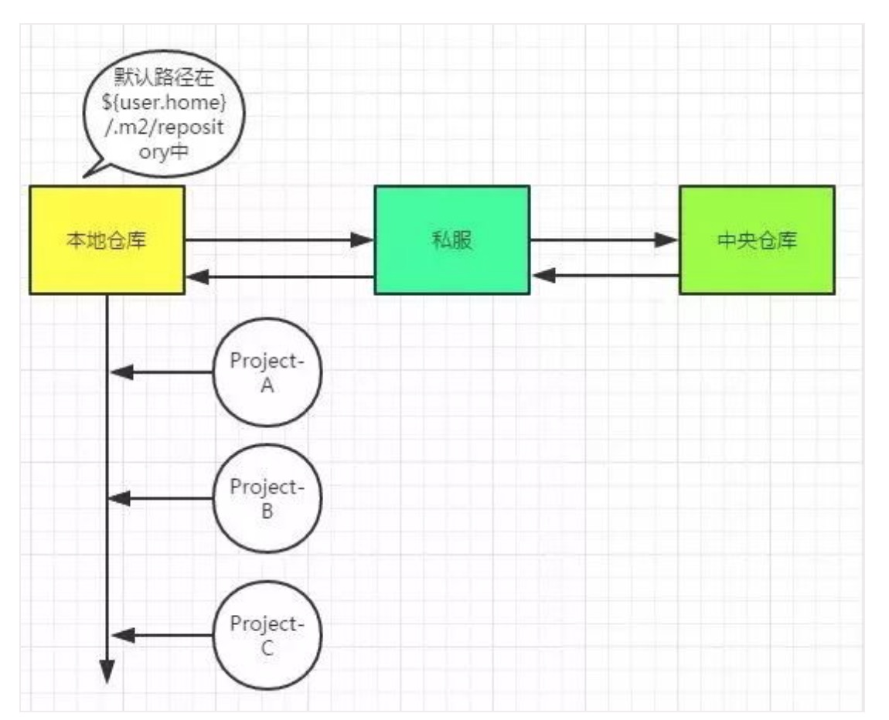
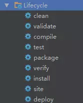

1、Maven工程标准架构、打包编译命令
2、Maven详解
Maven基本概念：仓库、jar
Maven依赖管理和依赖冲突解决
Maven生命周期
关于scope依赖范围
3、
4、
5、

---------------------------------------------------------------------------------------------------------------------
Maven详解

Maven基本概念：仓库、jar
Maven依赖管理和依赖冲突解决
Maven生命周期
关于scope依赖范围

Maven基本概念：仓库、jar

中央仓库：该仓库存储了互联网上的jar，由Maven团队来维护，地址是：http://repo1.maven.org/maven2/。

jar的查找坐标：groupId、artifactId、version。
查找：http://search.maven.org/、http://mvnrepository.com/上进行查找确定坐标。

使用Snapshot版本，在开发过程中B发布的版本标志为Snapshot版本，A进行依赖的时候选择Snapshot版本，那么每次B发布的话，会在私服仓库中，形成带有时间戳的Snapshot版本，而A构建的时候会自动下载B最新时间戳的Snapshot版本！

Maven依赖管理和依赖冲突解决

mvn dependency:tree命令形成依赖树

依赖传递：如果A依赖B，B依赖C，那么引入A，意味着B和C都会被引入。

Maven的最近依赖策略：如果一个项目依赖相同的groupId、artifactId的多个版本，那么在依赖树（mvn dependency:tree）中离项目最近的那个版本将会被使用。（从这里可以看出Maven是不是有点小问题呢？能不能选择高版本的进行依赖么？据了解，Gradle就是version+策略）

如何处理依赖冲突：
1、不管如何依赖传递，都可以进行版本锁定：使用<dependencyManagement>  [这种主要用于子模块的版本一致性中]
2、去掉我们不想依赖的：使用<exclusions> [在实际中我们可以在IDEA中直接利用插件帮助我们生成]
3、最近依赖策略，直接使用显式依赖指定版本，那不就是最靠近项目的么：使用<dependency>

Maven生命周期：

clean：有问题，多清理！
package：打成Jar or War包，会自动进行clean+compile
install：将本地工程Jar上传到本地仓库
deploy：上传到私服

关于scope依赖范围
既然，Maven的生命周期存在编译、测试、运行这些过程，那么显然有些依赖只用于测试，比如junit；有些依赖编译用不到，只有运行的时候才能用到，比如mysql的驱动包在编译期就用不到（编译期用的是JDBC接口），而是在运行时用到的；还有些依赖，编译期要用到，而运行期不需要提供，因为有些容器已经提供了，比如servlet-api在tomcat中已经提供了，我们只需要的是编译期提供而已。

总结来说：
compile：默认的scope，运行期有效，需要打入包中。
provided：编译期有效，运行期不需要提供，不会打入包中。
runtime：编译不需要，在运行期有效，需要导入包中。（接口与实现分离）
test：测试需要，不会打入包中。
system：非本地仓库引入、存在系统的某个路径下的jar。（一般不使用）

---------------------------------------------------------------------------------------------------------------------

Maven工程标准架构 
目录	备注
${basedir}	存放 pom.xml和所有的子目录
${basedir}/src/main/resources	项目的资源，如spring配置文件，properties资源文件等
${basedir}/src/main/webapps	web项目特有
${basedir}/src/test/java	项目的测试类，比如说 JUnit代码、TestNg代码
${basedir}/src/test/resources	测试代码使用的资源

打包：
mvn clean compile  -DskipTests -U -X -e 

mvn clean compile
mvn clean package
mvn clean install

-DskipTests
-Dmaven.test.skip=true  
-DskipTests=false  开启测试

使用-U参数： 该参数能强制让Maven检查所有SNAPSHOT依赖更新，确保集成基于最新的状态，如果没有该参数，Maven默认以天为单位检查更新，而持续集成的频率应该比这高很多。
使用-X参数：开启DEBUG模式。
使用-e参数：如果构建出现异常，该参数能让Maven打印完整的stack trace，以方便分析错误原因。
使用-B参数：该参数表示让Maven使用批处理模式构建项目，能够避免一些需要人工参与交互而造成的挂起状态。

---------------------------------------------------------------------------------------------------------------------

---------------------------------------------------------------------------------------------------------------------

